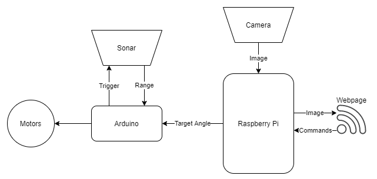
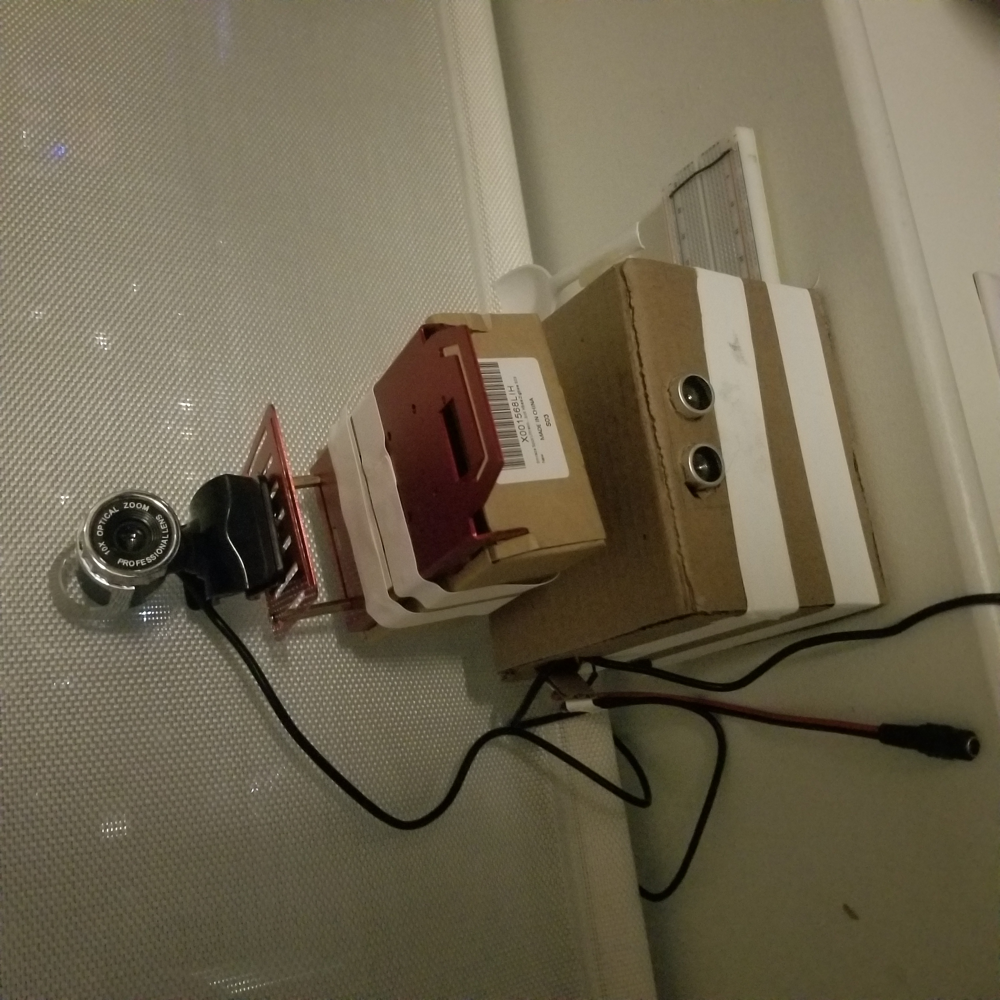

# BugBot

## Orignal Plan

Bugbot was intended to be a semi-autonomous, wheeled robot specially designed for bugging your friends. On propting, it would use a USB camera and RPi to locate a human target. Combining the camera data with ultrasonic range data onboard an Arduino microcontroller, BugBot would approach the target, squirt them with water, and play an irritating song.

## System-Level Diagram

## Challenges
A number of challenges were encountered during development. The one which had the biggest impact on the final deliverable was a rather silly issue with fasteners not being included with the robot kit from Adafruit. Unfortunately, the fasteners for connecting the motors to the robot chassis were not shipped with the kit, and were so small that they were not carried in hardware stores. In order to address this, BugBot became a turret, sitting on a servo, that rotates to follow human faces.  

## Final Implementation and Limitations
The turret prototype is essentially fully functional -- it tracks faces using a camera, monitors target distance using an ultrasonic sensor, and streams this information to a web server. It also features a throwing arm that can be actuated from the web server. There are, however, several limitations that could be substantially improved upon. The throwing arm's performance is quite poor, as the motor spins too slowly to effectively throw projectiles. This could be fixed by using a faster motor or an alternative firing mechanism. The camera has issues with overshoot when tracking faces. This is largely due to latency from the camera to the arduino and the high zoom of the camera. It may be possible to improve this by using a different camera. Latency reduction might require taking a sophisticated look at the algorithm being used for face tracking, but reducing it would likely make the PID controller much more effective, allowing for faster, more robust facial tracking.

## Picture of Submission.

